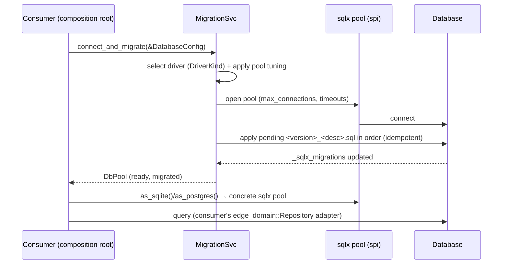
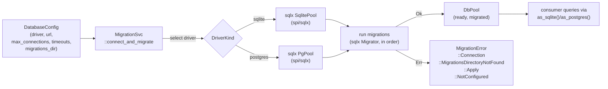

# Architecture — edge-egress-database

## Sequence

> At startup the composition root calls `connect_and_migrate(&DatabaseConfig)`:
> the crate opens a tuned `sqlx` pool, applies pending migrations in version
> order, and returns the ready pool. The consumer then queries through it.

## Data Flow

> A `DatabaseConfig` drives pool construction and schema evolution; the output is
> a ready `DbPool` the consumer owns.

