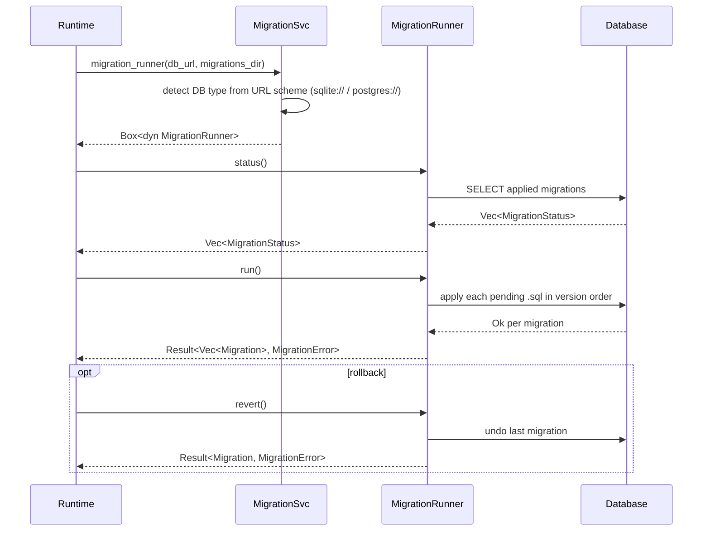
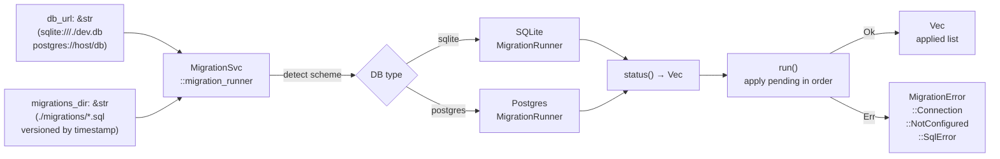

# Architecture — edge-egress-database

## Sequence

> The runtime creates a `MigrationRunner` from a connection URL at startup; the runner applies pending SQL migrations in version order.

## Data Flow

> A `(db_url, migrations_dir)` pair drives schema evolution; the output is the list of migrations applied in this run.

